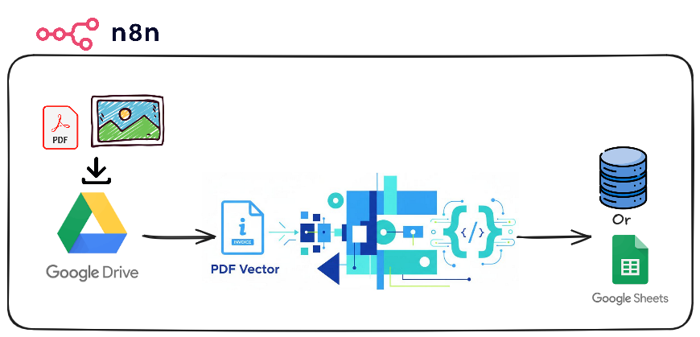
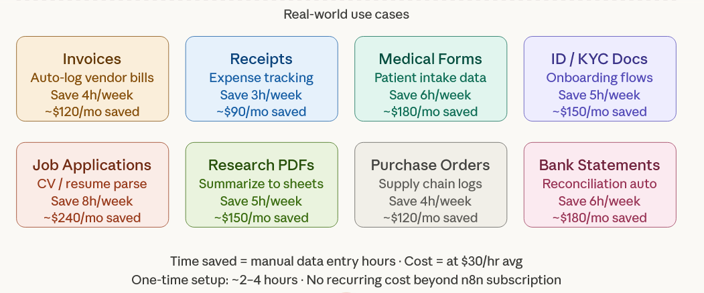

# 📄 Doc2Sheet

> **Automatically extract structured text from PDF files or images and save it into Google Sheets — zero manual data entry.**

---

## 📌 Use Case

Businesses and teams regularly receive documents — invoices, receipts, contracts, forms, and scanned images — that contain valuable data locked in unstructured formats. Manually reading, copying, and pasting this information into spreadsheets is:

- Slow and error-prone.
- Expensive at scale (hours of human labor per week).
- A bottleneck that delays reporting, reconciliation, and decisions.

The workflow mentioned below solves that by automating the full pipeline: **receive document → extract text using AI → structure the output → write rows into Google Sheets or any database**.

---

## ❗ The Problem

| Pain Point | Impact |
|---|---|
| Manual data entry from PDFs | 3–8 hours/week per team member |
| Typos and transcription errors | Costly downstream mistakes |
| Delayed reporting | Decisions made on stale data |
| No audit trail | Hard to verify what was logged and when |
| Doesn't scale | More volume = more headcount needed |

**Example:** A small finance team processing 50 invoices/week spends ~6 hours on data entry. At $30/hr, that's **$180/week or $9,360/year** in labor — for one task.

---

## ✅ The Solution

An n8n workflow that:

1. **Triggers** when a PDF or image file is uploaded (via webhook, email attachment, Google Drive, or form upload).
2. **Extracts text** PDF Vector AI model for intelligent field parsing.
3. **Structures the output** into named fields (e.g. vendor name, date, amount, line items).
4. **Appends a row** to a Google Sheets spreadsheet automatically.
---

## 🗂️ Workflow Architecture

### 
---

## 🌍 Real-World Use Cases

### 
---

## ⏱️ Time & Cost Summary

| Metric | Value |
|---|---|
| Average time saved per use case | 3–8 hours/week |
| Average cost saving (at $30/hr) | $90–$240/month per use case |
| Workflow setup time (one-time) | 2–4 hours |
| n8n hosting cost | Free (self-hosted) or ~$20/mo (cloud) |
| AI API cost (per document) | ~$0.001–$0.01 per page (varies based on API provider) |
| **Payback period** | **< 1 week** |

---

## 🛠️ Tech Stack

| Component | Tool |
|---|---|
| Automation engine | [n8n](https://n8n.io) |
| AI text parsing | [PDF Vector](https://www.pdfvector.com/#pricing) |
| Storage | Google Sheets or any database|
| Triggers | Webhook, Google Drive, Gmail, HTTP form |
| Notifications (optional) | Slack, Email |
---

## 📹 Video Walkthrough

    
    
  

### Note:

*Video Generated using **NotebookLM**—errors possible.*